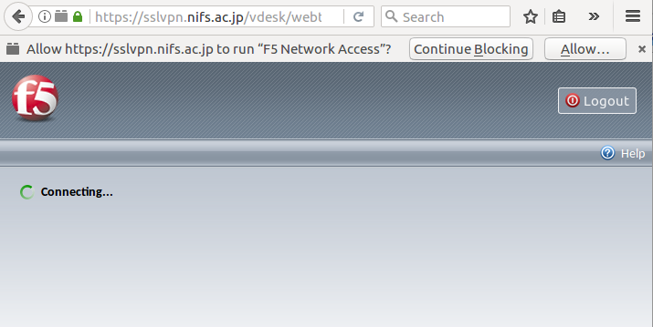

# Ubuntu-64 bit からNIFSのVPNにログインする

## 必要なもの
+ NIFSの OTP アカウント、OTPカード
+ Firefox ブラウザ

## Pluginのダウンロード
Firefoxブラウザを開き、http://sslvpn.nifs.ac.jp にアクセスする。  

OTPアカウント登録時にもらった
ユーザーネーム を Username に、

アカウント登録時にもらったパスワードと、**OTPカードに表示される6桁の数字** を
Password欄に記入し、Logon をクリックする。

このような画面が表示される。

** Allow plugins and continue with installation. を選ぶと失敗するので、 **  
必ず
** Download and install the software manually. ** にしたがって、
[こちら](https://sslvpn.nifs.ac.jp/public/download/linux_sslvpn.tgz)
からファイルをダウンロードする。

## Pluginのインストール
ダウンロードしたファイル (linux_sslvpn.tgz) を適当な場所で展開する。  
> tar -xvf linux_sslvpn.tgz

展開すると、以下のようなファイル構成になっている。

+ Install.sh
+ {+++ Firefox の ID +++}/META-INF
+ {+++ Firefox の ID +++}/plugins
+ {+++ Firefox の ID +++}/install.edf

### Install.sh の実行
sudo権限を使って、Install.sh を実行する。
> chmod +x Install.sh

> sudo ./Install.sh

以下のような問い合わせがあるが

> Would you like to install/update svpn components (yes/no)?

> Would you like to install/update CLI client (yes/no)?

yes と答える。

> Installation completed successfully

と出れば完成。

### plugins ディレクトリへのコピー
+ {+++ Firefox の ID +++}/META-INF
+ {+++ Firefox の ID +++}/plugins
+ {+++ Firefox の ID +++}/install.edf

を `~/.mozilla/`以下にコピーする。

> cp -r {+++ Firefox の ID +++}/META-INF  
> cp -r {+++ Firefox の ID +++}/plugins  
> cp -r {+++ Firefox の ID +++}/install.edf  

### 最後に
Firefox を再起動する。

## ログイン
Firefoxを開き、Username、PasswordおよびOTPカードの6桁の数字を入力し、
Logonボタンをクリックする。
以下のように、  
Pluginにアクセスしてもよいかという問い合わせがあるので、"Allow"をクリックする。

ログインが完了すると、NIFSの内部向けページ  
http://kaiseki-dev.lhd.nifs.ac.jp/  
などが表示できるので確認する。

## ログアウト
ログインしたページの右上にある Logout ボタンを押すとログアウトされる。
