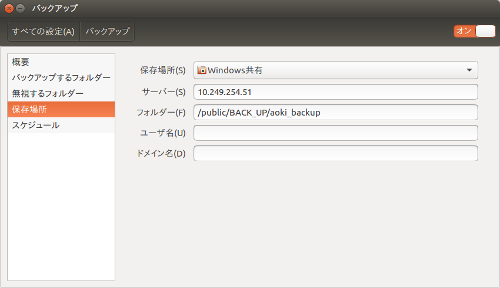
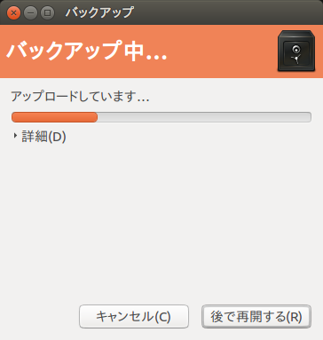

# バックアップの仕方

システム設定→バックアップ→

1,→概要：  
	設定完了前；インストールするべきアプリが表示される→インストール  
	設定完了後：復元、今すぐバックアップ  
2,→バックアップするフォルダー：+クリックでどのフォルダをバックアップするか指定  
3,→保存場所：  
	保存場所：研究室共有のパソコンを指定（windows共有)  
　　  	サーバー：研究室共有パソコンのIPアドレス  
　　  	フォルダー：/public/BACK_UP/name_backup  
4,→スケジュール：バックアップの頻度設定  
	自動バックアップをオンに  
途中で「ネットワークに接続されていません」など出てきたら、「これをインストールしてください」と表示が出るのでそれをインストールすること。

バックアップが成功すると以下のような画面が出る

