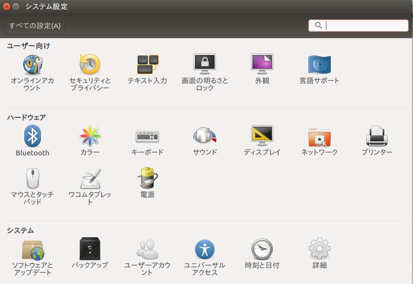

# 自動バックアップの設定方法
自分のパソコンが故障した時のため、重要なデータを定期的にバックアップする設定の仕方。　　

ubuntuホーム画面→コンピューターを検索→”システム設定”で検索→”システム設定”クリック  
すると以下の画面が出る。

   

→”バックアップ”クリック→

1,→概要：  
　設定完了前；インストールするべきアプリが表示される→インストール  
　設定完了後：復元、今すぐバックアップ  

2,→バックアップするフォルダー：+クリックでどのフォルダをバックアップするか指定  

3,→保存場所：  
　保存場所："windows共有"を選ぶ  
　サーバー：研究室共有パソコンのIPアドレス"１０．２４９．２５４．５１"を入力  
　フォルダー：/public/BACK_UP/[name]_backup  
　nameには各自の名前を入れてください

4,→スケジュール：バックアップの頻度設定  
　自動バックアップをオンに  
　途中で「ネットワークに接続されていません」など出てきたら、「これをインストールしてください」と表示が出るのでそれをインストールすること。

バックアップの設定が成功すると以下のような画面が出る。以降、概要→今すぐバックアップで同じ画面が出る。

