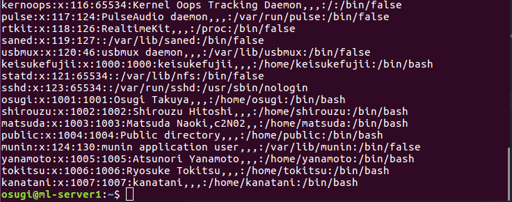

# サーバとローカルマシンのユーザIDが異なる場合の対処方法
サーバとローカルマシンでユーザIDが異なると、サーバ上に新たにファイルを作成した時に、その管理者が他の人になってしまう恐れがある。そのため、ローカルマシンのユーザIDを、サーバのユーザIDと同じものに変更する。

## サーバでのユーザIDの確認
まず、GPUサーバにログインする。
```
ssh [username]@10.249.254.54
```
次に、以下のコマンドで、ユーザ情報の一覧を表示する。
```
cat /etc/passwd
```
表示された一覧の下の方から、自分のユーザ名を探し、IDを確認する。



例えば、ユーザ名がosugiであれば、ユーザIDは1001であることがわかる。

## ローカルマシンでのユーザIDの変更
まず、
```
logout
```
でサーバからログアウトする。  

次に、以下のコマンドで、ローカルマシンにおけるユーザIDを確認する。
```
id [username]
```
その結果、
```
uid=1000([username]) gid=1000([username]) groups=1000([username]) （以下略）
```
と表示される。uidとgidが、前節で確かめたサーバのものと異なっていれば、以下の操作を行う。

まず、ユーザをダミーグループに移す。
```
sudo groupadd -g 2000 tmpgroup   # ダミーのグループ作成
sudo usermod -g tmpgroup   # ユーザのグループをダミーに

```
gidが変更されたことを確認する。
```
id [username]
  uid=1000([username]) gid=2000(tmpgroup)（以下略）
```
次に、元のグループを削除し、新たなグループを作成する。
```
sudo groupdel [username]   # 元グループの削除
sudo groupadd -g [サーバでのID] [username]   # 新しいグループの作成
sudo usermod -g [サーバでのID] [username]   # 新しいグループに変更
```
```
id [username]   # id確認
  uid=1000([username]) gid=[サーバでのID]([username])（以下略）
```
最後に、ダミーグループを削除し、uidを変更する。
```
sudo groupdel tmpgroup   # ダミーグループの削除
sudo usermod -u [サーバでのID] [username]   # 新しいuidに変更。失敗することもある（下記参照）
```
```
id [username]   # id確認
  uid=[サーバでのID]([username]) gid=[サーバでのID]([username])（以下略）
```
idが上記のようになっていれば成功である。

## uidの変更に失敗する場合
uidの変更で、「user ... is currently used by process ...」のようなエラーが出た場合は、次の操作を行う。  
まず、次のコマンドで新しいユーザを作成する。
```
sudo adduser test
```
いろいろ聞かれるが、パスワードだけ設定すればよい。  
次に、先ほどのユーザにsudo権限をつけ、再起動する。
```
sudo gpasswd -a test sudo
sudo reboot   # 再起動
```
新しく作成したtestユーザにログインし、そこからuidを変更する。
```
sudo usermod -u [サーバでのID] [username]
```
変更できたら再起動し、自分のアカウントにログインする。

最後に、先ほど作成したtestユーザを削除する。
```
sudo userdel -r test
```
（-r はhomeのディレクトリも一緒に削除するオプション）
